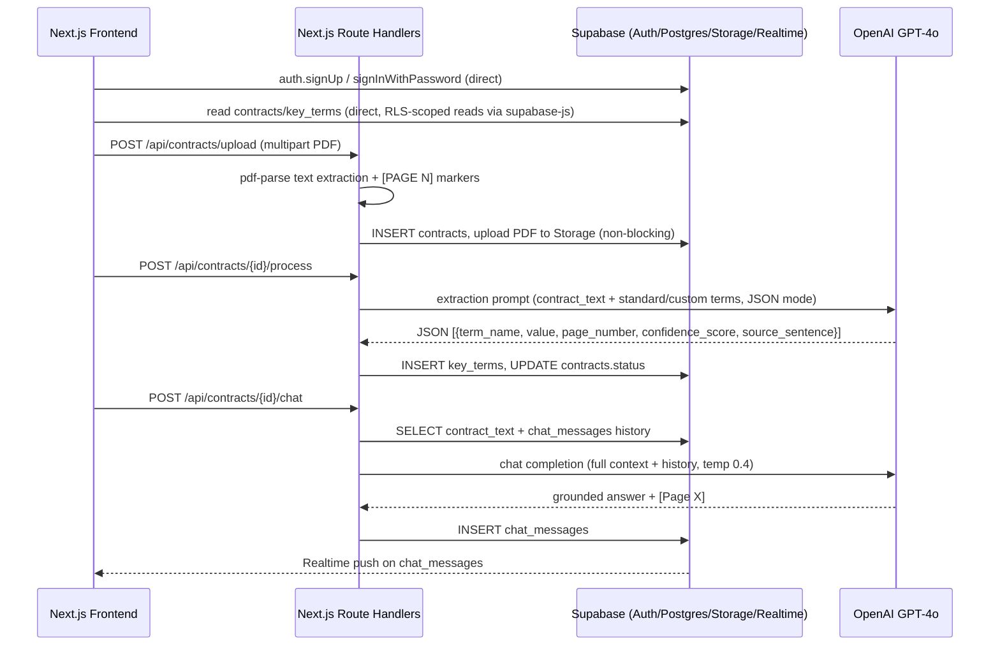
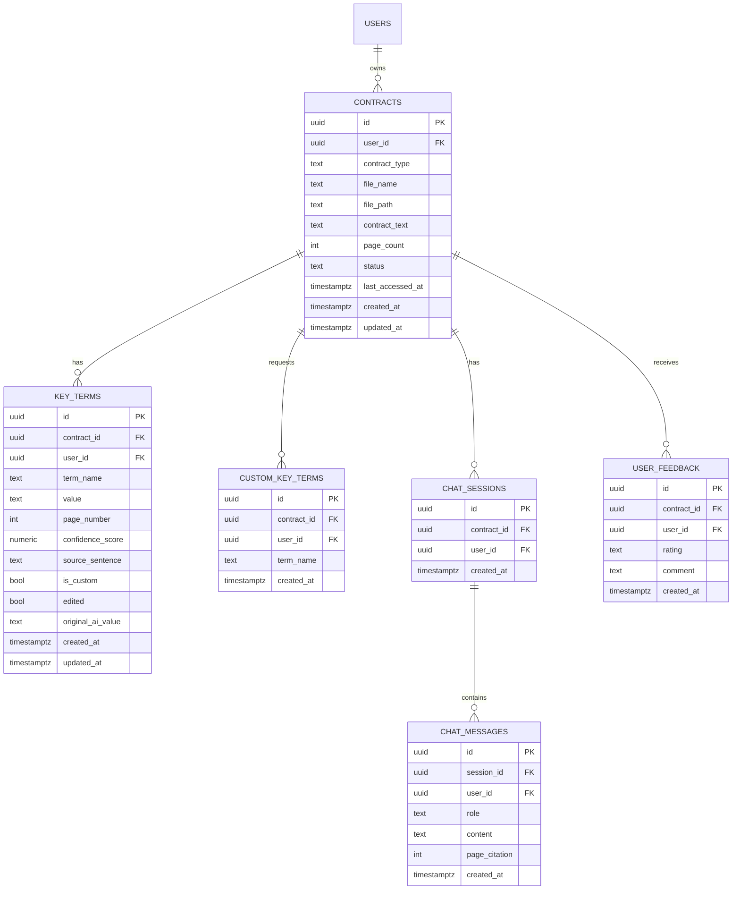

# ContractIQ — Engineering Document

**Version:** 1.0
**Status:** Draft — pending approval
**Source:** `docs/ContractIQ_PRD.md` (v1.0, June 24 2026)
**Companion:** `docs/design.md` (design system — colors, type, spacing, components)

---

## 1. Executive Summary

**Project:** ContractIQ — an AI-assisted contract review tool for Non-Disclosure Agreements (NDA) and Master Service Agreements (MSA).

**Business goal:** Let SMB founders, ops leads, procurement managers, and freelancers understand what they're signing without hiring a lawyer, by automatically extracting the 10–17 key terms that matter for NDAs/MSAs, showing exactly where each term lives in the document, how confident the extraction is, and answering follow-up questions in plain English — grounded strictly in the uploaded document.

**Problem statement:** Manual review of a single NDA/MSA takes 90–120 minutes and typically requires legal expertise SMBs don't have in-house. Generic AI chat tools produce unstructured summaries with no page reference, no confidence score, and no schema. Rule-based parsers miss >30% of real-world clause variants. ContractIQ closes this gap with a contract-type-specific extraction schema, page-level attribution, confidence scoring, and a chat interface that refuses to answer from anything but the uploaded text.

**Target users:**
- **Primary — Time-Pressed Founder / Ops Lead:** 5–250 employee companies, no in-house counsel, signs 5–15 NDAs/MSAs per month.
- **Secondary — Freelancer / Consultant:** receives 1–4 client MSAs per month, can't afford legal review, needs to spot non-standard/risky clauses.

**Success criteria (from PRD §3):**

| Metric | Baseline | Target |
|---|---|---|
| Time from upload to completed key-term review (North Star) | 90 min manual | ≤ 15 min end-to-end |
| Key-term extraction accuracy (F1) | 0% (no tool) | ≥ 88% F1 (NDA), ≥ 85% F1 (MSA) |
| Confidence score calibration | — | Predicted confidence within ±10% of observed accuracy |
| Time to first extracted key-term display | — | ≤ 30s P95 for ≤ 20-page contracts |
| Cost per contract analysis | — | ≤ $0.25 (extraction target ≤ $0.20) |
| 30-day retention | — | ≥ 45% |
| AI extraction correction rate | — | ≤ 12% of terms manually corrected |
| Chat hallucination rate | — | ≤ 5% of Q&A pairs |

This document defines the technical architecture required to hit these targets. It is the authoritative reference for all subsequent stages (implementation specs, scaffolding, feature build, testing, deployment, security hardening) — no implementation begins until it is approved.

---

## 2. Product Scope

### In scope (MVP, v0.1–v1.0)

- Email/password authentication (Supabase Auth)
- PDF upload (≤ 10 MB, ≤ 20 pages, ≤ 15,000 tokens), text-layer only
- Server-side text extraction with `[PAGE N]` page markers, stored once in the DB
- Contract type selection: NDA or MSA (English-language, US/UK law conventions only)
- Standard key-term extraction via GPT-4o (10 terms for NDA, 12 for MSA — see §8)
- Up to 5 user-defined custom key terms per analysis
- Confidence score (0–100%) per extracted term, colour-coded (green ≥ 80%, amber 50–79%, red < 50%)
- Page-number attribution + verbatim source-sentence ("Why?") per term
- Inline PDF viewer (PDF.js) with click-to-navigate from key term → page, plus a text-viewer fallback when Storage/signed URL is unavailable
- Inline correction of extracted term values, with original AI value retained
- Contract chat (Q&A) grounded strictly in the uploaded document, with mandatory `[Page X]` citations and persistent chat history
- Dashboard: contract history, counts by type, sortable list
- Thumbs up/down feedback with optional comment
- Row Level Security on every table; signed URLs with 1-hour expiry; AES-256 at rest, TLS 1.3 in transit
- WCAG 2.1 AA compliant UI; "Not legal advice" disclaimer on every results page

### Out of scope (MVP)

- Scanned/image PDFs (OCR) — graceful rejection only ("Scanned PDFs are not supported yet")
- Non-English contracts / non-US/UK legal conventions
- Contract types other than NDA and MSA
- Multi-user / team workspaces, seats, roles beyond a single account owner
- Contract-to-contract comparison
- Export to CSV/PDF, batch upload
- Chunked/vector RAG (full-context strategy only, contracts ≤ 15,000 tokens)
- Email notifications

### Future enhancements (post-v1.0, per PRD roadmap)

- **v1.1:** Export key terms to CSV, export summary to PDF, batch upload (≤ 5 contracts), dashboard analytics charts
- **v1.2:** OCR for scanned PDFs (AWS Textract or equivalent), side-by-side contract comparison, email notifications, multi-user workspaces (team plans)

---

## 3. User Personas

| Persona | Role / Company | Behaviour | Primary workflow | Permissions |
|---|---|---|---|---|
| **Time-Pressed Founder / Ops Lead** (primary) | Founder, COO, Procurement Manager, Legal Ops Manager at a 5–250-employee company with no in-house counsel | Signs 5–15 NDAs/MSAs per month; currently relies on Google + ad-hoc paid legal review | Upload → review key terms → verify low-confidence flags → chat for follow-up questions → move on | Standard account owner — full CRUD on own contracts, chat, feedback |
| **Freelancer / Consultant** (secondary) | Individual contributor (design, marketing, dev, consulting) | Receives 1–4 client MSAs/month; signs without full review due to power imbalance with larger clients | Upload → scan for risky/non-standard clauses → verify liability/IP/termination terms → chat | Standard account owner — identical permission set to primary persona |

There is a single account role at MVP — no admin, no team/workspace roles, no reviewer-vs-owner distinction. Every table is scoped to `user_id = auth.uid()` via RLS; no cross-user or shared-contract access exists in this version. (Multi-user workspaces are explicitly deferred to v1.2 per the PRD roadmap.)

---

## 4. User Flows

Format: `User Action → Frontend Behavior → Backend Processing → Database Interaction → System Response`

### 4.1 Sign Up → Dashboard

1. **User Action:** Visitor clicks "Get Started Free" on the marketing landing page (`app/(marketing)/page.tsx`).
2. **Frontend Behavior:** Opens a sign-up modal (email + password fields, client-side Zod validation for email format / password length ≥ 8 chars).
3. **Backend Processing:** Frontend calls `supabase.auth.signUp()` directly (no Route Handler involved — Supabase Auth is called client-side per architecture in §6).
4. **Database Interaction:** Supabase writes a row to `auth.users`; a Postgres trigger is **not** needed since no `public.profiles` table exists at MVP (email/password only, no profile fields required by the PRD).
5. **System Response:** On success, Supabase issues a session (JWT in httpOnly cookie via `@supabase/ssr`), the app redirects to `/dashboard`, which renders the empty state: "No contracts reviewed yet — upload your first contract to begin."

### 4.2 Returning User → Dashboard

1. **User Action:** User signs in via email/password on `/sign-in`.
2. **Frontend Behavior:** Form posts to `supabase.auth.signInWithPassword()` client-side; on success, TanStack Query prefetches `/api/contracts`.
3. **Backend Processing:** `GET /api/contracts` Route Handler verifies the session cookie, queries Supabase.
4. **Database Interaction:** `SELECT` on `contracts` filtered by `user_id = auth.uid()` (enforced by RLS), aggregated by `contract_type` for the summary card.
5. **System Response:** Dashboard renders total contracts, breakdown by NDA/MSA, last 5 contracts with status + date, and a prominent "Review a Contract" CTA.

### 4.3 Core Flow — Contract Review (Upload → Extraction → Results)

1. **User Action:** User clicks "Review Contract," selects contract type (NDA/MSA) from a dropdown, then drags/drops or picks a PDF.
2. **Frontend Behavior:** Client validates file type (`application/pdf`), size (≤ 10 MB) before upload; shows a pre-processing preview card listing the standard terms for the selected type (static list, no API call yet) with a "+ Add Key Term" control (up to 5 custom terms, client-side capped).
3. **Backend Processing:** On "Process Contract," frontend `POST`s multipart form data to `/api/contracts/upload`. The Route Handler: (a) validates size/type/page count server-side, (b) runs `pdf-parse` to extract text with `[PAGE N]` markers inserted per page break, (c) rejects with "Scanned PDFs are not supported yet" if extracted text < 100 words, (d) rejects if token estimate > 15,000, (e) uploads the original PDF to Supabase Storage (non-blocking — failure only disables the PDF viewer, `file_path` stays `null`), (f) creates the `contracts` row with `status = 'uploaded'`. The frontend then calls `POST /api/contracts/{id}/process`, which builds the extraction prompt (standard terms for the contract type + any custom terms), calls GPT-4o in JSON mode, parses and validates the response (single retry on invalid JSON), and writes rows to `key_terms`.
4. **Database Interaction:** `INSERT` into `contracts` (with `contract_text`, `file_path`, `status`); `INSERT` into `custom_key_terms` for user-added terms; `INSERT` into `key_terms` per extracted term (standard + custom); `UPDATE contracts SET status = 'completed'`.
5. **System Response:** Progress indicator advances through 3 steps (extracting text → analysing with AI → compiling results); results page renders with the PDF viewer (or text-viewer fallback) on the left and the key terms panel (name, value, page, confidence, colour-coded) on the right. Terms with confidence < 50% show a ⚠️ warning and auto-highlight the nearest matching page span.

### 4.4 Inline Term Correction

1. **User Action:** User clicks an extracted term's value to edit it.
2. **Frontend Behavior:** Value becomes an editable input; on blur/submit, an optimistic UI update fires via TanStack Query mutation.
3. **Backend Processing:** `PATCH /api/contracts/{id}/key-terms/{termId}` validates the new value, verifies ownership via RLS, writes `original_ai_value` (if not already set) and `edited = true`.
4. **Database Interaction:** `UPDATE key_terms SET value = $1, edited = true, original_ai_value = COALESCE(original_ai_value, value_before_update), updated_at = now()`.
5. **System Response:** Term displays an "Edited" badge; save completes within 2 seconds (PRD constraint); the correction is now visible in the `term_corrections` view for the feedback loop.

### 4.5 Chat With Contract

1. **User Action:** User opens the "Chat with Contract" tab/floating button and types a question (e.g. "What happens if I breach the NDA?").
2. **Frontend Behavior:** Message is optimistically appended to the chat thread (right-aligned); input disabled while awaiting response.
3. **Backend Processing:** `POST /api/contracts/{id}/chat` fetches the full `contract_text`, all prior messages in the session (ascending, up to 200), classifies the query (`contract` / `history` / `both`) to adjust system-prompt framing, and calls GPT-4o (temp 0.4, max 1,000 output tokens) with a system prompt enforcing document-only answers and a mandatory `[Page X]` citation.
4. **Database Interaction:** `INSERT` into `chat_sessions` (if none exists yet for the contract) and two `chat_messages` rows (`role = 'user'`, then `role = 'assistant'`) with `page_citation` parsed from the response.
5. **System Response:** Assistant response renders left-aligned within 15 seconds P95, prefixed "Based on the document…", with a clickable `Source: Page X` citation that scrolls the PDF/text viewer to that page. A Supabase Realtime subscription on `chat_messages` gives the UI a live-updating feel if multiple tabs are open.

### 4.6 Feedback Submission

1. **User Action:** User clicks thumbs up/down on the results page and optionally adds a comment.
2. **Frontend Behavior:** Renders a lightweight rating widget; submits immediately on click (comment is optional and can follow).
3. **Backend Processing:** `POST /api/contracts/{id}/feedback` validates `rating ∈ {up, down}` and comment length (≤ 1,000 chars).
4. **Database Interaction:** `INSERT INTO user_feedback (user_id, contract_id, rating, comment)`.
5. **System Response:** Toast confirmation "Thanks for the feedback."

---

## 5. Frontend Architecture

### Stack

- **Framework:** Next.js 14, App Router, TypeScript (fixed per project convention)
- **Styling:** Tailwind CSS, tokens mapped 1:1 from `docs/design.md` (ink/indigo/green/amber/red palette, 4px spacing grid, radius scale) via `tailwind.config.ts` theme extension
- **Component primitives:** shadcn/ui (Radix UI under the hood) for accessible base components (Dialog, Select, Tooltip, Tabs, Toast) — required to hit WCAG 2.1 AA without hand-rolling ARIA behaviour
- **Icons:** Lucide (per design.md)
- **Fonts:** Newsreader (marketing display), Instrument Sans (UI), JetBrains Mono (citations/confidence %) — loaded via `next/font/google`
- **Server state:** TanStack Query — contracts list, contract detail, key terms, chat messages, feedback. Query keys namespaced per resource (`['contracts']`, `['contract', id]`, `['chat', sessionId]`).
- **Client-only UI state:** React `useState`/`useReducer` for local component state (upload wizard step, custom-term draft inputs); no global client-state library is needed beyond TanStack Query's cache — a Zustand store is added only if upload-wizard state needs to survive route changes (e.g. resuming an in-progress upload).
- **PDF rendering:** `pdfjs-dist` client-side, lazy page rendering (render pages near viewport only) to handle large files without blocking the main thread.
- **Realtime:** `@supabase/supabase-js` Realtime channel subscribed to `chat_messages` filtered by `session_id`.

### Routing strategy (App Router route groups)

```
app/
  (marketing)/          — public, no auth required
  (auth)/                — sign-in / sign-up (also reachable as a modal from marketing)
  (app)/                 — authenticated area, layout enforces session via middleware
    dashboard/
    contracts/
      upload/
      [contractId]/
```

`middleware.ts` checks the Supabase session cookie on every request under `(app)/**` and redirects unauthenticated users to `/sign-in`.

### UX states

| State | Handling |
|---|---|
| Loading | Skeleton loaders for dashboard cards, key-terms panel, chat thread (no spinners-only — skeletons match final layout to avoid layout shift) |
| Empty | Dashboard empty state; "no custom terms yet" state in upload wizard |
| Error | Upload rejection (file type/size/page count/scanned-PDF/token-limit) shown inline on the upload card; OpenAI timeout/error shown with a "Try again in a few minutes" CTA per PRD; contract `status = 'error'` allows retry without re-upload |
| Low confidence | ⚠️ badge + non-dismissible tooltip on any term < 50% confidence; term is always shown, never hidden |
| Responsive | Two-panel results layout (PDF + key terms) collapses to stacked/tabbed on viewports < 768px |
| Accessibility | All interactive elements keyboard-navigable; colour is never the only signal (confidence always paired with % and tier word per design.md); focus rings use `--brand`; `aria-live="polite"` region for chat responses and toasts |

### Page / component hierarchy

```
app/(marketing)/page.tsx                 — landing page (hero, feature grid, how-it-works, footer)
app/(auth)/sign-in/page.tsx              — sign-in
app/(auth)/sign-up/page.tsx              — sign-up
app/(app)/dashboard/page.tsx             — SummaryCards + ContractsTable
app/(app)/contracts/upload/page.tsx      — UploadForm + KeyTermPreviewList + CustomTermInput
app/(app)/contracts/[contractId]/page.tsx — two-panel: PdfViewer|TextViewerFallback + KeyTermsPanel, ChatPanel (tab/floating)

components/
  ui/                — shadcn primitives (Button, Input, Select, Checkbox, Switch, Badge, Toast, Tooltip, Card, Modal, Tabs)
  contracts/
    UploadForm.tsx
    KeyTermPreviewList.tsx
    CustomTermInput.tsx
    KeyTermsPanel.tsx
    KeyTermRow.tsx         — term name, value (editable), page link, ConfidenceBadge
    ConfidenceBadge.tsx    — signature component: tier dot + % + label
    PdfViewer.tsx           — PDF.js wrapper, targetPage prop
    TextViewerFallback.tsx  — parses [PAGE N] markers, same targetPage prop contract as PdfViewer
    SourceSentenceTooltip.tsx — "Why?" expandable
    Disclaimer.tsx          — "Not legal advice" banner
  chat/
    ChatPanel.tsx
    ChatMessage.tsx         — user/assistant bubble + citation chip
    ChatInput.tsx
  dashboard/
    SummaryCards.tsx
    ContractsTable.tsx
  feedback/
    FeedbackWidget.tsx
```

---

## 6. Backend Architecture

### Stack

Next.js **Route Handlers** (`app/api/**`) running on Vercel, colocated with the frontend in a single deployable. No separate Deno/Edge Functions runtime — this keeps local dev, types, and validation shared between frontend and backend (one language, one repo, one deploy pipeline).

### Core systems

- **Auth:** Supabase session verified in every Route Handler via `@supabase/ssr`'s server client, reading the httpOnly session cookie. No handler trusts a client-supplied `user_id` — it is always derived from the verified JWT (`auth.uid()`), and Postgres RLS is the second, non-bypassable enforcement layer.
- **Authorization:** Enforced primarily by Postgres RLS (every table has `user_id`, policy `user_id = auth.uid()`). Route Handlers do not additionally hand-roll ownership checks beyond what RLS already guarantees, except where a handler uses the Supabase **service role** key (only for the Storage signed-URL generation and the OpenAI orchestration calls that need to bypass RLS to write derived data on the user's behalf after re-verifying the session).
- **Business logic:** Kept in `lib/` modules (`lib/pdf/extract-text.ts`, `lib/openai/extraction.ts`, `lib/openai/chat.ts`, `lib/openai/prompts/*`), imported by thin Route Handlers — handlers orchestrate, `lib/` modules implement.
- **Validation:** Zod schemas in `lib/validation/*` for every request body and the OpenAI JSON response shape. Requests failing validation return `400` with a field-level error map.
- **Error handling:** Every Route Handler returns a uniform error envelope `{ error: { code, message } }`; unhandled exceptions are caught by a shared `withErrorHandling()` wrapper, logged, and returned as `500` with a generic message (no stack traces leaked to the client).
- **Retry policy:** All OpenAI calls go through `lib/openai/with-retry.ts` — 3 attempts with exponential backoff (1s/2s/4s) on transient errors (5xx, timeout); a single additional retry is issued specifically for invalid-JSON extraction responses (per PRD §8's error-recovery prompt), independent of the transport-retry budget.
- **Rate limiting:** Per-user token-bucket limiter (in-memory + Vercel KV/Upstash Redis for multi-instance consistency) on all OpenAI-calling routes (`/upload`'s process step, `/chat`) — caps concurrent contract processing and chat calls per user to protect the $0.25/analysis cost budget and the 100-concurrent-analysis scalability constraint.
- **Middleware:** `middleware.ts` handles auth-gate redirects for `(app)/**` pages; Route Handlers each re-verify auth independently (defense in depth — middleware alone is not treated as sufficient authz).

### Service interaction diagram



---

## 7. Database Design and Schema

Postgres (Supabase). Every table carries a direct `user_id uuid references auth.users(id)` column (per PRD FR-13) so RLS policies are a uniform `user_id = auth.uid()` check without cross-table subqueries. `contracts.id` is the join key for everything else. All `created_at`/`updated_at` columns are `timestamptz default now()`, with `updated_at` maintained by a shared trigger.

### ER Diagram



### `contracts`

**Purpose:** One row per uploaded document; stores the extracted text (single source of truth for AI processing and chat — the PDF file itself is never re-read after upload).

| Column | Type | Notes |
|---|---|---|
| `id` | `uuid` PK, `default gen_random_uuid()` | |
| `user_id` | `uuid` NOT NULL, FK → `auth.users(id)` ON DELETE CASCADE | |
| `contract_type` | `contract_type_enum` NOT NULL | `'nda'` \| `'msa'` |
| `file_name` | `text` NOT NULL | original upload filename |
| `file_path` | `text` NULL | Storage object path; `null` if Storage upload failed (non-blocking) |
| `contract_text` | `text` NOT NULL | full extracted text with `[PAGE N]` markers |
| `page_count` | `int` NOT NULL | validated ≤ 20 |
| `status` | `contract_status_enum` NOT NULL default `'uploaded'` | `'uploaded'` \| `'processing'` \| `'completed'` \| `'error'` |
| `last_accessed_at` | `timestamptz` NOT NULL default `now()` | drives the 90-day retention auto-delete job |
| `created_at` / `updated_at` | `timestamptz` | |

**Indexes:** `(user_id, created_at desc)` for dashboard listing; `(user_id, status)`.
**Constraints:** `CHECK (page_count <= 20)`.

### `key_terms`

**Purpose:** Extracted (and optionally user-corrected) key terms — both standard and custom terms land here after processing, with identical structure per FR-05.

| Column | Type | Notes |
|---|---|---|
| `id` | `uuid` PK | |
| `contract_id` | `uuid` NOT NULL, FK → `contracts(id)` ON DELETE CASCADE | |
| `user_id` | `uuid` NOT NULL, FK → `auth.users(id)` ON DELETE CASCADE | denormalized for RLS |
| `term_name` | `text` NOT NULL | |
| `value` | `text` NOT NULL | |
| `page_number` | `int` NOT NULL | 1-indexed |
| `confidence_score` | `numeric(5,2)` NOT NULL | 0–100 |
| `source_sentence` | `text` NOT NULL | verbatim source; a term without one is rejected at parse time |
| `is_custom` | `bool` NOT NULL default `false` | true if requested via `custom_key_terms` |
| `edited` | `bool` NOT NULL default `false` | |
| `original_ai_value` | `text` NULL | set on first edit only |
| `created_at` / `updated_at` | `timestamptz` | |

**Indexes:** `(contract_id)`; `(user_id)`; partial index `(contract_id) WHERE confidence_score < 50` to speed the low-confidence warning query.
**Constraints:** `CHECK (confidence_score >= 0 AND confidence_score <= 100)`; `CHECK (page_number >= 1)`.

### `custom_key_terms`

**Purpose:** The user-requested custom term names captured *before* processing (FR-05) — distinct from `key_terms`, which holds the *results* (including custom-term results, flagged `is_custom = true`).

| Column | Type | Notes |
|---|---|---|
| `id` | `uuid` PK | |
| `contract_id` | `uuid` NOT NULL, FK → `contracts(id)` ON DELETE CASCADE | |
| `user_id` | `uuid` NOT NULL, FK → `auth.users(id)` ON DELETE CASCADE | |
| `term_name` | `text` NOT NULL | |
| `created_at` | `timestamptz` | |

**Constraints:** unique `(contract_id, term_name)`; application-level cap of 5 rows per `contract_id` (enforced in the Route Handler, not the DB, so the error message can be user-friendly).

### `chat_sessions`

**Purpose:** One chat session per contract (created lazily on first message).

| Column | Type | Notes |
|---|---|---|
| `id` | `uuid` PK | |
| `contract_id` | `uuid` NOT NULL, FK → `contracts(id)` ON DELETE CASCADE, UNIQUE | one session per contract at MVP |
| `user_id` | `uuid` NOT NULL, FK → `auth.users(id)` ON DELETE CASCADE | |
| `created_at` | `timestamptz` | |

### `chat_messages`

**Purpose:** Persisted chat turns; source for the "up to 200 messages, ascending" context window and for reloading history when a contract's results page reopens (US-012).

| Column | Type | Notes |
|---|---|---|
| `id` | `uuid` PK | |
| `session_id` | `uuid` NOT NULL, FK → `chat_sessions(id)` ON DELETE CASCADE | |
| `user_id` | `uuid` NOT NULL, FK → `auth.users(id)` ON DELETE CASCADE | |
| `role` | `chat_role_enum` NOT NULL | `'user'` \| `'assistant'` |
| `content` | `text` NOT NULL | |
| `page_citation` | `int` NULL | parsed `[Page X]`; null only for `role = 'user'` rows or "not found" answers with no page |
| `created_at` | `timestamptz` | |

**Indexes:** `(session_id, created_at asc)` — the exact access pattern for loading history.

### `user_feedback`

**Purpose:** Thumbs up/down + comment per contract review (FR-12).

| Column | Type | Notes |
|---|---|---|
| `id` | `uuid` PK | |
| `contract_id` | `uuid` NOT NULL, FK → `contracts(id)` ON DELETE CASCADE | |
| `user_id` | `uuid` NOT NULL, FK → `auth.users(id)` ON DELETE CASCADE | |
| `rating` | `feedback_rating_enum` NOT NULL | `'up'` \| `'down'` |
| `comment` | `text` NULL | ≤ 1,000 chars, enforced at the API layer |
| `created_at` | `timestamptz` | |

**Indexes:** `(contract_id)`.

### `term_corrections` (view)

**Purpose:** Feeds the PRD §8 improvement loop ("Log every user edit… trigger a prompt review if correction rate exceeds 12% of terms in any 7-day window").

```sql
CREATE VIEW term_corrections AS
SELECT id, contract_id, user_id, term_name, original_ai_value, value AS corrected_value, updated_at
FROM key_terms
WHERE edited = true;
```

### Storage

- **Bucket:** `contracts` (private).
- **Path pattern:** `contracts/{user_id}/{contract_id}/{filename}.pdf`.
- **Access:** 1-hour signed URLs generated server-side (Route Handler using the service role key, after re-verifying the requesting user owns the contract). RLS on `storage.objects` additionally restricts INSERT/SELECT/DELETE to `auth.uid()::text = (storage.foldername(name))[1]`.
- **Non-blocking:** upload failure leaves `contracts.file_path = null`; the PDF viewer falls back to the text viewer, the AI pipeline is entirely unaffected since it reads `contract_text` from the DB.
- **Retention:** PDFs and their contract rows are deleted 90 days after `last_accessed_at` (scheduled job, see §8/§10 Phase 3) or immediately on user-initiated delete (`DELETE /api/contracts/{id}` cascades to Storage object + all child rows via `ON DELETE CASCADE`).

*(The exact runnable SQL — enums, tables, triggers, indexes, RLS policies, storage bucket/policy statements — is produced as `docs/specs/supabase-schema.sql` in Stage 2 by the `/implementation-specs` skill; this section defines the schema those statements must implement.)*

---

## 8. AI Architecture

### Provider & model

| Criteria | Value |
|---|---|
| Provider | OpenAI |
| Model | GPT-4o |
| Context window | ≥ 128k tokens (contract ≈ 10k–15k tokens; headroom for prompt + few-shot examples + history) |
| Response format | JSON mode (`response_format: { type: "json_object" }`) for extraction |
| Max output tokens | 2,000 (extraction) / 1,000 (chat) |
| Temperature | 0.1 (extraction — deterministic) / 0.4 (chat — natural but grounded) |
| Target latency | ≤ 20s P95 per call |
| Target cost | ≤ $0.20 per 20-page extraction; ≤ $0.25 total per analysis |

### Standard term schema

**NDA (10 terms):** Parties, Effective Date, Confidentiality Obligations, Permitted Disclosures, Term & Duration, Governing Law, Jurisdiction, IP Ownership, Non-Solicitation, Breach & Remedy.

**MSA (12 terms):** Parties, Service Scope, Payment Terms, Invoice Schedule, Late Payment Penalty, Liability Cap, Indemnification, IP Ownership, Termination Clause, Governing Law, Dispute Resolution, Notice Period.

Custom terms (≤ 5) are appended to this list as additional zero-shot extraction targets, sharing the identical output schema.

### Prompt strategy

| Task | Technique | Output |
|---|---|---|
| Key term extraction | Few-shot: 3 labelled NDA examples + 3 labelled MSA examples embedded in the system prompt | `[{ term_name, value, page_number, confidence_score, source_sentence }]` |
| Confidence scoring | Embedded in the same extraction call — model self-reports 0.0–1.0 per term (no second call) | float field on each term object |
| Custom term extraction | Zero-shot, term name injected as an additional target in the same prompt | same schema as standard terms |
| Contract chat | Full contract text as context + full conversation history (ascending, ≤ 200 messages) + a query-classification step (`contract` / `history` / `both`, cheaply inferred without an extra API call) that adjusts system-prompt framing | free text + mandatory `[Page X]` citation |
| Error recovery | On JSON parse failure: one retry with "Your previous response was not valid JSON. Return only the JSON array, no explanation." | JSON array |

**Full-context strategy:** for contracts ≤ 15,000 tokens, the entire `contract_text` is passed on every extraction and chat call — no chunking or vector retrieval at MVP, guaranteeing no relevant clause is missed to retrieval error. Chunked RAG is deferred until the contract-length ceiling is raised post-v1.0.

**Prompt library versioning:** prompts live in `lib/openai/prompts/*.ts`, versioned (`v1.0`, `v1.1`, …) via an exported `PROMPT_VERSION` constant per file; the version is logged alongside every extraction row (as a code-level audit trail, not a DB column) so a monthly A/B eval against the 50-contract offline set can attribute accuracy shifts to a specific prompt version.

### Token limits & cost controls

- Contracts > 15,000 estimated tokens are rejected at upload with a clear message (before any OpenAI call is made).
- `lib/openai/with-retry.ts` wraps every call: 3 attempts, exponential backoff, surfaced to the user as "Try again in a few minutes" on final failure; `contracts.status` set to `'error'` so the user can retry without re-uploading.
- Per-user rate limiting (see §6) caps concurrent OpenAI-calling requests to protect the cost budget and respect the 100-concurrent-analysis scalability constraint.
- Monthly usage is monitored against the $0.25/analysis budget; an alert fires at 80% of the monthly budget threshold (operational concern, tracked outside the app in the OpenAI usage dashboard per PRD §6).

### Hallucination guardrails

- **Extraction:** temperature 0.1 + JSON mode; every term must carry a non-empty `source_sentence` or it is treated as unreliable and dropped before being written to `key_terms`; confidence < 50% never hides a term, it flags it.
- **Chat:** system prompt: *"Answer only from the document text provided. If the answer is not in the document, say so."*; every response is required to include a `[Page X]` citation (validated server-side — a response missing a citation and not matching the "not found" pattern is treated as a soft failure and retried once with a stricter instruction); responses are prefixed "Based on the document…".
- **Automated regression test:** a fixed test asks a question about a topic absent from a known test document and asserts the response is "I cannot find this in the document" (part of the Testing Strategy, §13).

### Fallback plan (contingency, not built at MVP)

If OpenAI pricing more than doubles or availability degrades materially, Claude 3.5 or Gemini 1.5 Pro are the evaluated fallbacks (per PRD §13 Assumption 1 and the External Dependencies table). The `lib/openai/*` modules are structured behind a thin provider interface (`extractTerms(contractText, terms): Promise<ExtractionResult>`, `chatCompletion(...)`) specifically so a future provider swap does not touch Route Handlers or the DB schema — this interface is defined now but only one implementation (OpenAI) ships at MVP.

---

## 9. API Specification

All endpoints under `app/api/contracts/**`. Auth: every endpoint requires a valid Supabase session cookie; `401` if absent/expired. Ownership is enforced by RLS on every DB operation; a request for a contract the caller doesn't own returns `404` (not `403`, to avoid confirming existence).

### `POST /api/contracts/upload`

- **Purpose:** Upload a PDF, extract text, create the `contracts` row.
- **Auth:** required
- **Request:** `multipart/form-data` — `file: File`, `contract_type: 'nda' | 'msa'`
- **Response `201`:** `{ contract_id: string, page_count: number, status: 'uploaded' }`
- **Validation:** file type `application/pdf`; size ≤ 10 MB; page count ≤ 20 (checked post-parse); extracted word count ≥ 100 else reject
- **Errors:** `400` invalid file/type/size, `422` scanned-PDF / token-limit exceeded, `500` extraction failure

### `POST /api/contracts/{id}/custom-terms`

- **Purpose:** Register up to 5 custom key terms before processing.
- **Auth:** required, must own contract
- **Request:** `{ terms: string[] }` (1–5 items, each ≤ 80 chars)
- **Response `200`:** `{ custom_terms: { id, term_name }[] }`
- **Errors:** `400` >5 terms or duplicate term names, `404` contract not found/not owned

### `POST /api/contracts/{id}/process`

- **Purpose:** Run GPT-4o extraction against the standard + custom term list; write `key_terms`.
- **Auth:** required, must own contract
- **Request:** `{}` (no body — reads `contract_type`, `contract_text`, and `custom_key_terms` server-side)
- **Response `200`:** `{ status: 'completed', key_terms: KeyTerm[] }`
- **Validation:** contract must be in `status = 'uploaded'` or `'error'` (idempotent retry)
- **Errors:** `409` already processing, `502` OpenAI failure after retries (status set to `'error'`)

### `GET /api/contracts`

- **Purpose:** Dashboard list.
- **Auth:** required
- **Query params:** `sort ∈ {date, name, type}`, `order ∈ {asc, desc}` (default `date desc`)
- **Response `200`:** `{ contracts: ContractSummary[], total: number, by_type: { nda: number, msa: number } }`

### `GET /api/contracts/{id}`

- **Purpose:** Contract detail — metadata + key terms + signed URL (if `file_path` present).
- **Auth:** required, must own contract
- **Response `200`:** `{ contract: Contract, key_terms: KeyTerm[], signed_url: string | null }`
- **Errors:** `404` not found/not owned

### `GET /api/contracts/{id}/signed-url`

- **Purpose:** Refresh the 1-hour signed URL when it expires client-side.
- **Auth:** required, must own contract
- **Response `200`:** `{ signed_url: string | null, expires_at: string }` (`null` if `file_path` is null — client falls back to text viewer)

### `PATCH /api/contracts/{id}/key-terms/{termId}`

- **Purpose:** Inline correction of an extracted term.
- **Auth:** required, must own contract
- **Request:** `{ value: string }`
- **Response `200`:** `{ key_term: KeyTerm }` (with `edited: true`, `original_ai_value` populated)
- **Validation:** `value` non-empty, ≤ 2,000 chars
- **Errors:** `404` term/contract not found

### `POST /api/contracts/{id}/chat`

- **Purpose:** Send a chat message, get a grounded response.
- **Auth:** required, must own contract
- **Request:** `{ message: string }` (≤ 2,000 chars)
- **Response `200`:** `{ message: ChatMessage /* assistant */ }`
- **Errors:** `400` empty/too-long message, `502` OpenAI failure after retries

### `GET /api/contracts/{id}/chat`

- **Purpose:** Load persisted chat history for a contract's session.
- **Auth:** required, must own contract
- **Response `200`:** `{ messages: ChatMessage[] }` (ascending order, ≤ 200)

### `POST /api/contracts/{id}/feedback`

- **Purpose:** Submit thumbs up/down + optional comment.
- **Auth:** required, must own contract
- **Request:** `{ rating: 'up' | 'down', comment?: string }` (comment ≤ 1,000 chars)
- **Response `201`:** `{ feedback: Feedback }`

### `DELETE /api/contracts/{id}`

- **Purpose:** User-initiated full deletion (GDPR right-to-delete).
- **Auth:** required, must own contract
- **Response `204`**
- **Behaviour:** deletes the Storage object (if present), cascades DB deletion via FK `ON DELETE CASCADE` across `key_terms`, `custom_key_terms`, `chat_sessions`, `chat_messages`, `user_feedback`.

**Shared error envelope** (all endpoints): `{ "error": { "code": "VALIDATION_ERROR" | "NOT_FOUND" | "UNAUTHORIZED" | "RATE_LIMITED" | "UPSTREAM_ERROR" | "INTERNAL_ERROR", "message": string } }`.

---

## 10. Feature Breakdown

### Phase 1 — MVP core review flow (maps to PRD v0.1–v0.2, P0 stories)

| Feature | Description | Acceptance Criteria | Dependencies |
|---|---|---|---|
| Auth (US-001) | Email/password sign up, sign in, sign out | Auth completes ≤ 10s; redirect to dashboard on success; clear error on invalid credentials | Supabase project provisioned |
| PDF upload + text extraction (US-002) | Upload ≤10MB/≤20pg PDF, server-side text extraction with page markers | Extraction ≤ 30s P95 for ≤20 pages; key terms panel shows ≥80% of standard terms with values | Auth |
| Page attribution (US-003) | Every term shows its source page | Clicking page number scrolls viewer to that page | Upload+extraction |
| Confidence display (US-004) | 0–100% score per term, colour-coded, ⚠️ below 50% | Scores <50% show warning + tooltip | Upload+extraction |
| Custom term addition (US-005) | Up to 5 user-defined terms before processing | Custom terms appear in preview and in results with identical structure | Upload+extraction |
| Key terms panel (US-011-partial) | Term/value/page/confidence display | Panel renders for both NDA and MSA term sets | Upload+extraction |

### Phase 2 — Enriched experience & chat/history (maps to PRD v0.3–v0.4, P1 stories)

| Feature | Description | Acceptance Criteria | Dependencies |
|---|---|---|---|
| Inline PDF viewer (US-006) | PDF.js viewer, scroll/zoom, clickable highlighted spans | All pages render; text-viewer fallback when Storage unavailable | Phase 1 |
| Contract chat (US-007) | Grounded Q&A over the contract | Response ≤15s P95; every response cites a page; "I cannot find this" for absent info | Phase 1 |
| Persistent chat history (US-012) | Reopening results reloads prior chat | History loads in original order on page open | Chat |
| Dashboard + history (US-008) | Sortable contract list, counts by type | Sortable by date/name/type; row click opens results | Phase 1 |
| Inline key term editing (US-009) | Edit an extracted value | Save ≤2s; "Edited" badge shown; original value retained | Phase 1 |
| Error states | Upload failure / OpenAI timeout surfaces | Human-readable message + retry CTA; no silent failures | Phase 1 |

### Phase 3 — Feedback, hardening, launch (maps to PRD v1.0, P2 + launch criteria)

| Feature | Description | Acceptance Criteria | Dependencies |
|---|---|---|---|
| Feedback submission (US-010) | Thumbs up/down + comment | Stored in `user_feedback`; visible on results page | Phase 1 |
| Performance optimisation | Hit ≤30s P95 end-to-end | Verified against eval suite (§13) | Phase 1–2 complete |
| Security audit | RLS verification, signed URL expiry, key management | No cross-user data access in test accounts; RLS unit tests pass in CI | All phases |
| WCAG 2.1 AA review | Accessibility pass on all pages | Automated (axe) + manual keyboard-nav pass | Phase 1–2 complete |
| Rate limiting | Per-user OpenAI call caps | Verified under simulated concurrent load | Backend §6 |
| Onboarding tooltips | First-time-user guidance | Shown once per user, dismissible | Phase 1–2 complete |
| 90-day retention job | Auto-delete PDFs/contracts past retention | Scheduled job deletes rows/objects past `last_accessed_at + 90d` | DB schema |

*(v1.1 export/batch-upload/analytics and v1.2 OCR/comparison/team-workspaces are explicitly out of scope per §2 — not planned in these phases.)*

---

## 11. Folder Structure

```
contractiq/
├── app/
│   ├── (marketing)/
│   │   └── page.tsx                     — landing page
│   ├── (auth)/
│   │   ├── sign-in/page.tsx
│   │   └── sign-up/page.tsx
│   ├── (app)/
│   │   ├── layout.tsx                   — auth-gated shell (nav, session check)
│   │   ├── dashboard/page.tsx
│   │   └── contracts/
│   │       ├── upload/page.tsx
│   │       └── [contractId]/page.tsx
│   └── api/
│       └── contracts/
│           ├── route.ts                 — GET (list)
│           ├── upload/route.ts          — POST
│           └── [contractId]/
│               ├── route.ts             — GET, DELETE
│               ├── process/route.ts     — POST
│               ├── custom-terms/route.ts— POST
│               ├── signed-url/route.ts  — GET
│               ├── key-terms/[termId]/route.ts — PATCH
│               ├── chat/route.ts        — GET, POST
│               └── feedback/route.ts    — POST
├── components/
│   ├── ui/                              — shadcn primitives
│   ├── contracts/                       — UploadForm, KeyTermsPanel, PdfViewer, TextViewerFallback, ConfidenceBadge, ...
│   ├── chat/                            — ChatPanel, ChatMessage, ChatInput
│   ├── dashboard/                       — SummaryCards, ContractsTable
│   └── feedback/                        — FeedbackWidget
├── lib/
│   ├── supabase/
│   │   ├── client.ts                    — browser client
│   │   ├── server.ts                    — server (Route Handler) client, cookie-bound
│   │   └── admin.ts                     — service-role client (signed URLs, storage ops)
│   ├── openai/
│   │   ├── client.ts
│   │   ├── with-retry.ts
│   │   ├── extraction.ts
│   │   ├── chat.ts
│   │   └── prompts/
│   │       ├── nda-extraction.ts
│   │       ├── msa-extraction.ts
│   │       └── chat-system-prompt.ts
│   ├── pdf/
│   │   └── extract-text.ts              — pdf-parse wrapper, [PAGE N] marker insertion
│   ├── validation/
│   │   ├── contracts.ts                 — Zod schemas for API requests
│   │   └── extraction-response.ts       — Zod schema for OpenAI JSON output
│   ├── rate-limit.ts
│   └── errors.ts                        — uniform error envelope + withErrorHandling()
├── hooks/
│   ├── use-contracts.ts
│   ├── use-contract.ts
│   ├── use-key-terms.ts
│   ├── use-chat.ts
│   └── use-signed-url.ts
├── types/
│   ├── contract.ts
│   ├── key-term.ts
│   └── chat.ts
├── middleware.ts                        — auth gate for (app)/**
├── docs/
│   ├── ContractIQ_PRD.md
│   ├── design.md
│   ├── engineering/
│   │   └── engineering-doc.md           — this file
│   └── specs/                           — Stage 2 output (supabase-schema.sql, .env.example, granular specs)
├── tailwind.config.ts
├── next.config.mjs
├── tsconfig.json
└── package.json
```

---

## 12. Naming Conventions

| Category | Convention | Examples |
|---|---|---|
| Files / folders | kebab-case | `key-terms-panel.tsx`, `with-retry.ts`, `contracts/upload/` |
| React components | PascalCase (file name matches export) | `KeyTermsPanel.tsx` exports `KeyTermsPanel` |
| Hooks | camelCase, `use` prefix | `useContracts`, `useSignedUrl` |
| API route files | Next.js convention — `route.ts` inside kebab-case segment folders | `app/api/contracts/[contractId]/chat/route.ts` |
| API JSON fields | snake_case (matches DB columns directly — no camelCase transform layer) | `contract_id`, `page_number`, `confidence_score` |
| DB tables | snake_case, plural | `contracts`, `key_terms`, `chat_messages` |
| DB enums | snake_case, `_enum` suffix | `contract_status_enum`, `feedback_rating_enum` |
| DB columns | snake_case | `user_id`, `source_sentence` |
| Env vars | SCREAMING_SNAKE_CASE | `OPENAI_API_KEY`, `SUPABASE_SERVICE_ROLE_KEY` |
| Zod schemas | PascalCase, `Schema` suffix | `UploadRequestSchema`, `ExtractionResponseSchema` |
| Types/interfaces | PascalCase | `Contract`, `KeyTerm`, `ChatMessage` |
| Tailwind design tokens | kebab-case CSS custom properties (matches design.md) | `--confidence-high`, `--bg-surface` |

---

## 13. Testing Strategy

| Layer | Framework | Coverage target | Examples |
|---|---|---|---|
| Unit | Vitest | ≥ 80% on `lib/` modules | `extract-text.ts` page-marker insertion, `with-retry.ts` backoff timing, confidence colour-tier mapping, Zod schema edge cases, query-classification (`contract`/`history`/`both`) logic |
| Component | Vitest + React Testing Library | Key interactive components | `ConfidenceBadge` renders correct tier/colour by score, `KeyTermRow` inline-edit flow, `ChatMessage` citation rendering |
| Integration | Vitest, Route Handlers invoked directly against a disposable Supabase test project | All API endpoints in §9 | Upload→process→key_terms round trip; RLS cross-user isolation test (user B cannot read user A's contract — expect `404`); chat message persistence + ordering |
| E2E | Playwright | Golden paths + critical edge cases | Sign-up→upload→results→chat; low-confidence term shows warning and is not hidden; scanned-PDF upload is rejected with the correct message; inline edit persists after reload; OpenAI failure shows retry CTA and contract stays retryable |
| Accessibility | axe-core (automated, run in CI against key pages) + manual keyboard-only pass | WCAG 2.1 AA | Upload wizard, results page, chat panel |

**Offline model-quality eval (separate track from app tests, owned by the product/ML process, not CI):** F1 against the 30 NDA + 20 MSA labelled set (target ≥88%/≥85%), confidence calibration curve (target ≤0.10 error), page-attribution accuracy (≥92%), custom-term F1 (≥80%), chat groundedness review (≤5% hallucinated) — run every release per PRD §10, using the CUAD dataset + internally labelled contracts. This is functional/product-quality evaluation, distinct from the automated test suite above, and does not gate CI — it gates release readiness per the HHH launch criteria (PRD §11).

**Automated hallucination regression test:** a fixed E2E/integration test feeds a chat question about a topic absent from a known fixture contract and asserts the response is "I cannot find this in the document" — this one *does* run in CI since it tests the guardrail's code path, not model quality per se.

---

## 14. Specs to Implementation Mapping

| Feature (§10) | Spec source | Implementation files |
|---|---|---|
| Auth (US-001) | This doc §4.1–4.2, §7 (`auth.users`) | `app/(auth)/**`, `middleware.ts`, `lib/supabase/client.ts`, `lib/supabase/server.ts` |
| PDF upload + extraction (US-002) | §4.3, §9 (`POST /upload`), §7 (`contracts`) | `app/api/contracts/upload/route.ts`, `lib/pdf/extract-text.ts`, `components/contracts/UploadForm.tsx` |
| Key term extraction + confidence (US-003, US-004, US-011-partial) | §8 (AI Architecture), §9 (`POST /process`), §7 (`key_terms`) | `app/api/contracts/[contractId]/process/route.ts`, `lib/openai/extraction.ts`, `lib/openai/prompts/*`, `components/contracts/KeyTermsPanel.tsx`, `ConfidenceBadge.tsx` |
| Custom terms (US-005) | §9 (`POST /custom-terms`), §7 (`custom_key_terms`) | `app/api/contracts/[contractId]/custom-terms/route.ts`, `components/contracts/CustomTermInput.tsx` |
| PDF viewer + fallback (US-006) | §9 (`GET /signed-url`), §5 | `components/contracts/PdfViewer.tsx`, `TextViewerFallback.tsx`, `hooks/use-signed-url.ts` |
| Chat (US-007, US-012) | §4.5, §8, §9 (`/chat`), §7 (`chat_sessions`, `chat_messages`) | `app/api/contracts/[contractId]/chat/route.ts`, `lib/openai/chat.ts`, `components/chat/**`, `hooks/use-chat.ts` |
| Dashboard (US-008) | §4.2, §9 (`GET /contracts`) | `app/(app)/dashboard/page.tsx`, `components/dashboard/**`, `hooks/use-contracts.ts` |
| Inline editing (US-009) | §4.4, §9 (`PATCH /key-terms/{id}`) | `components/contracts/KeyTermRow.tsx`, `app/api/contracts/[contractId]/key-terms/[termId]/route.ts` |
| Feedback (US-010) | §4.6, §9 (`POST /feedback`), §7 (`user_feedback`) | `components/feedback/FeedbackWidget.tsx`, `app/api/contracts/[contractId]/feedback/route.ts` |
| RLS / security | §7, §6 | `docs/specs/supabase-schema.sql` (generated in Stage 2), `lib/supabase/admin.ts` |
| Retention job | §10 Phase 3 | scheduled Supabase cron / Vercel cron hitting a dedicated cleanup Route Handler (defined in Stage 2 specs) |

Each row's spec content becomes a dedicated file under `docs/specs/` in Stage 2 (`/implementation-specs`), and each implementation-file column becomes real code in Stage 4 (feature implementation), one feature at a time, per `CLAUDE.md`'s workflow.

---

**Next step:** Review this document. When approved, Stage 2 (`/implementation-specs`) turns it into granular runnable specs, `docs/specs/supabase-schema.sql`, and `.env.example`.
